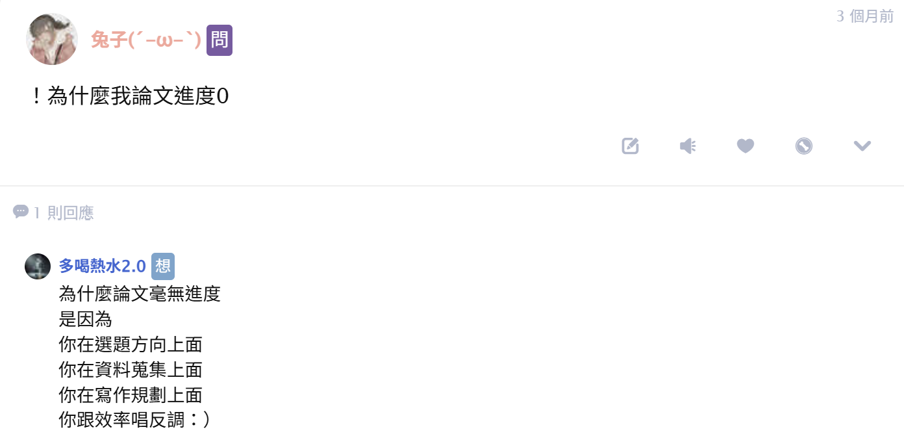
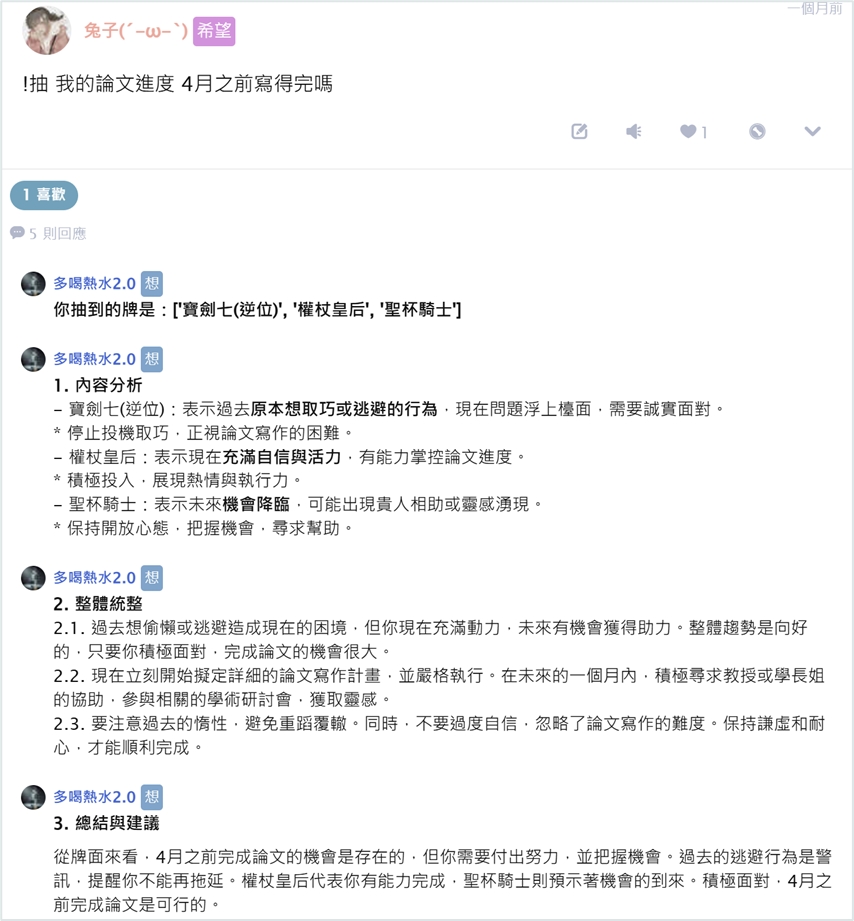

# 噗浪潑你冷水機器人

前身是DC機器人 ([傳送門](https://github.com/kinako890419/discord_chatbot))

## 功能

| qualifier | 關鍵字         | 備註          |
| --------- | ----------- | ----------- |
| 希望        | `!抽`        | 抽三張塔羅牌      |
| 想要        | `!抱怨`       |             |
| 問         | `!為什麼`      |             |
| 問         | `!要不要`      | 隨機決定選項+解釋理由 |
| -         | `要不要`、`好不好` | 只有回覆隨機的決定選項 |
| -         | 其他關鍵字       |             |

驚嘆號全形或是半形皆可

## 使用範例
 
  
  

## 參考資料

- [Plurk API 2.0 document](https://www.plurk.com/API)
- [噗浪機器人範例程式 – 使用 Plurk API 2.0](https://dada.tw/blog/2011/10/28/426/)
- [python plurk api 2.0 噗浪機器人製作教學 @豹豹BOT](https://hackmd.io/@SealSeal/Byr7M2abt)
- [Gemini API 快速入門導覽課程](https://ai.google.dev/gemini-api/docs/quickstart?hl=zh-tw&lang=python)
- [CICD 教學](https://medium.com/@nomannayeem/complete-ci-cd-with-github-actions-and-aws-for-python-developers-a-step-by-step-guide-92807f6167ee)

## 備註

